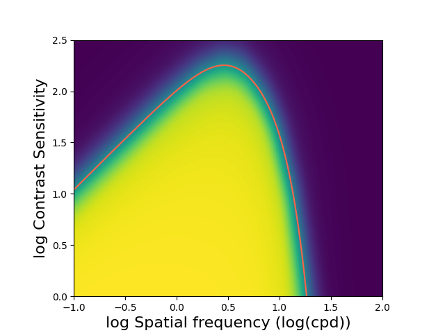

# Neural Estimation by Sequential Testing (NEST)
Welcome to the Neural Estimation by Sequential Testing (NEST) Github repository. NEST is a method for simultaneously estimating the psychometric function and generating new trials for a (psychovisual) experiment. The method is currently under peer review. The submitted manuscript can be accessed via [[1]](#1).

In this repository, the code of the NEST method is available. For prospective users of the method, the NEST class encapsulates the entire algorithm such that the method can be used with only a handful of concrete interactions. The user only needs to start up the 
experiment, and then the user can request new trials and submit responses in a loop until the end of the experiment. The script `NEST_example_script.py` contains a simple synthetic two-dimensional function estimation problem that showcases all of the basic communication required to use the method. The pre-evaluated results are already available in the repository in the Results folder. The script `NEST_example_data_analysis.py` shows how the data can be analysed at the end of an experiment, in this case by visualising the estimated function from the previous script. Lastly, the `spatiotemporal_experiment.py` script contains the code for the psychovisual experiment from [[2]](#2) that was performed for this research. 

The code was created using Python 3.8, and the required libraries are given in the requirements.txt file. 

## Step-by-step explanation for using the NEST procedure
We provide the NEST procedure in an encapsulated Python object with a number of useful methods for the general user. In the following, we explain the general procedure for using the NEST procedure in a Python script. The full script is available in the `NEST_example_script.py` file. We take a number of steps to produce a full experiment:

1. Initialise the NEST Python object:
```python
NEST_object = NEST()
```
This command starts up the communication between the NEST algorithm and the API that you can subsequently address.

2. Initialise the parameters of the experiment:
```python
num_trials = 100
num_dims = 2 # Number of stimulus dimensions, e.g. spatial frequency, eccentricity, etc.
lbs = [-1, 0] # Minimum value of the input space for each stimulus dimension
ubs = [2, 2.5] # Maximum value of the input space for each stimulus dimension

experiment_params = {
    "num_dims": num_dims, 		# Number of stimulus dimensions in the experiment
    "lbs": lbs, 			# Minimum values for each stimulus dimension
    "ubs": ubs, 			# Maximum values for each stimulus dimension 
    "p": 0.1, 				# Dropout probability of neural network. Set to default p = 0.1
    "lapse": 0.0, 			# Lapse rate, i.e. the probability of making a mistake even if the stimulus is clearly visible
    "asymptote": 0.0, 			# Lower asymptote, i.e. the minimum probability of a correct response when guessing
    "convergence_level": -1, 		# Convergence level of the convergence criterion. Set to -1 if not used
    "hidden_layers": [256, 128, 32],	# Architecture of the neural network. Set to default w = [256, 128, 32]
    "random_chance": 0.5 		# Initial rate of selecting a random sample instead of one from the acquisition function
}
```

3. Pass the experiment parameters and server configuration information to the NEST object and start a new NEST procedure:
```python
server_config = {
  "port": 3000, # An initial guess at an open port. If the port is occupied, the algorithm will try to find a different port to work with instead.
  "host": "127.0.0.1", # 'localhost', i.e. we make a connection to a server object that holds the NEST procedure via ports on the same device.
  "save_dir": "./Results" # The place where the results of the experiment (e.g. the trained network and the input/output data) will be stored.
}

NEST_object.start_new(server_config_dict=server_config, \
    experiment_params=experiment_params)
```
The `NEST_object.start_new(...)` method handles all the setup tasks of the NEST procedure for you. As becomes clear from the `server_config` dictionary, the code provides a client-server communication pattern between the API (which you will address your calls to) and a backend server where the NEST procedure resides and which will service any calls that you make. We have abstracted these details away so that you only need to worry about making the method calls to the API. At this point, you are ready to start the experiment loop.

4. Perform the experiment loop by retrieving the next trial to show to the participant and registering their response back to the NEST procedure:
```python
for i in range(num_trials): # Perform as many trials as you consider necessary		
    # Get the next sample from the NEST procedure. The sample 
    # represents the values of the stimulus dimensions to test in
    # the current trial
    sample = NEST_object.get_trial()

    # Generate a response. In your experiment, this will be the response given by the participant. For demonstration
    # purposes, we use a synthetic CSF function from which we get our response.
    response = evaluate_CSF(sample)

    # Report the response given by the participant back to the NEST procedure.
    NEST_object.register_result(response)
```
This Python for loop contains all the code necessary to perform the experiment loop as it relates to communicating with the NEST procedure. For your own experiment, the for loop will also contain code to display the actual stimulus and to gather a (button press) response from the participant, for example by using the PsychoPy [[3]](#3) library.

5. Send a termination message to signal to the NEST procedure to clean up the execution in a proper fashion:
```python
NEST_object.terminate()
```

## Step-by-step guide for evaluating the results of the NEST procedure
Once you have performed the experiment by following the steps described in the previous section, it is now time to evaluate the network and get an understanding of the function our experiment has just modeled. This section explains the steps taken in the script `NEST_example_data_analysis.py`. 

1. Read the directory name from the command line:
```python
data_dir = os.path.expanduser(sys.argv[1]) if len(sys.argv) > 1 else "./Results"
```
This command reads the directory in which the results of the experiment were stored from the input on the command line. The code is written such that you store each experiment in a unique directory.

2. Load the training data gathered in the experiment:
```python
train_in = torch.from_numpy(np.load(f"{data_dir}/train_in.npy"))
```
The code converts the training data, which was stored in a NumPy [[4]](#4) file format, into a PyTorch [[5]](#5) format.

3. Initialise a grid over which we evaluate the function:
```python
num_grid_samples = 200 # Number of samples along each axis
x_range = np.linspace(-1, 2, num_grid_samples) # The range of values across the x-axis. The values are the lower and upper bound of the first dimension, respectively.
y_range = np.linspace(0, 2.5, num_grid_samples) # The range of values across the y-axis. The values are the lower and upper bound of the second dimension, respectively.
(X, Y) = np.meshgrid(x_range, y_range) # Meshgrid arrays which represent the value of the first dimension (X) and the value of the second dimension (Y).
	
G = torch.from_numpy(np.stack((X, Y), axis=-1)) # Stack the X and Y arrays such that we have an array that exposes both the x- and y-value at each point on the grid.
```
The resulting array G has the shape `(num_grid_samples, num_grid_samples, 2)`, and each entry in the `num_grid_samples x num_grid_samples` grid exposes two values, namely the x- and y-value at this point in the grid. This grid now has the shape we need in order to evaluate each point on the grid using the neural network trained by the NEST procedure.

4. Initialise the neural network structure and load its state from a file:
```python
# Initialise relevant experiment parameters
num_dims = 2
asymptote = 0.0
lapse = 0.0
w = [256, 128, 32]
p = 0.1
	
layers = [num_dims] +  w + [1]
	
nn_params = {"dropout_probability": p, "lapse": lapse, \
    "asymptote": asymptote}

# Initialise the neural network object and then load its state from file		
neural_net = Dropout_Neural_Network(layers, **nn_params)
nn_filename = f"{data_dir}/neural_net.pth"
neural_net.load_state_dict(torch.load(nn_filename))
```

5. Determine the standardisation values `mu` and `sigma` based on the mean and standard deviation of the training data:
```python
mu, sigma = compute_mu_sigma(train_in)

def compute_mu_sigma(train_in):
	mu = torch.mean(train_in, dim=0)
	sigma = torch.std(train_in, dim=0, unbiased=True)
	
	return mu, sigma
```
These standardisation values will be used to standardise the grid in the same way the training data has been standardised during the training procedure.

6. Evaluate the grid using the neural network:
```python
neural_net.set_double() # Set the data type to a double to match the data type of G
neural_net.set_predict() # Set the neural network to prediction mode instead of training mode
with torch.no_grad(): # Ensure that PyTorch does not accumulate a gradient during evaluation
    G_out = neural_net((G - mu) / sigma) # We standardise G before applying the neural network to get the output probability of a correct response.
```
`G_out` now represents the probability of detection at each point on the grid, and we are ready to plot the results.

7. Compute the threshold of the reference function (for our specific example) and plot the results:
```python
# Evaluate the reference CSF function
thres = evaluate_threshold(x_range) # Details about the reference function are not important for the purposes of this demonstration.
	
# Visualise result:
# - Red line: threshold of the underlying function
# - colormap: probability of detection (blue = 0.0, yellow = 1.0)
fig, ax = plt.subplots()
ax.imshow(G_out, origin="lower", extent=[-1, 2, 0, 2.5])
	
ax.plot(x_range, thres, color="tomato")
ax.set_ylim(bottom=0, top=2.5)
	
ax.set_xlabel("log Spatial frequency (log(cpd))", fontsize=16)
ax.set_ylabel("log Contrast Sensitivity", fontsize=16)
	
plt.show()
```
At the end, we find the following plot, which represents the output of NEST alongside the location of the threshold of the reference function:



As can be seen from the figure, this simple example has a very close correspondence with the ground truth function, as seen by the fact that the threshold function (orange) lies in the transition region everywhere in the input space. This example has shown how to go from a finished experiment to a visualisation of the results, during which we loaded our trained neural network, prepared the data for evaluation, and visualised the evaluated data grid. For your own experiment, you can similarly explore the dimensions of your experiment, either via visualisation of the entire input space or, for example, by studying two-dimensional slices of the (higher-dimensional) input space that you chose to study.

 
## References
<a id="1">[1]</a> 
Bruin, Sjoerd et al. (2024). 
NEST: Neural Estimation by Sequential Testing. 
ArXiv: https://doi.org/10.48550/arXiv.2405.04226

<a id="2">[2]</a>
Tursun, Cara & Didyk, Piotr (2023).
Perceptual Visibility Model for Temporal Contrast Changes in Periphery.
ACM Transactions on Graphics, Volume 42, Issue 2.

<a id="3">[3]</a>
Peirce, J. W. et al. (2019).
PsychoPy2: experiments in behavior made easy.
Behavior Research Methods, Volume 51, pp. 195-203.

<a id="4">[4]</a>
Harris, Charles R. et al. (2020).
Array programming with NumPy.
Nature, Volume 585, issue 7825, pp.357-362.

<a id="5">[5]</a>
Paszke, Adam et al. (2017).
Automatic differentiation in PyTorch.
NIPS 2017 conference. 
